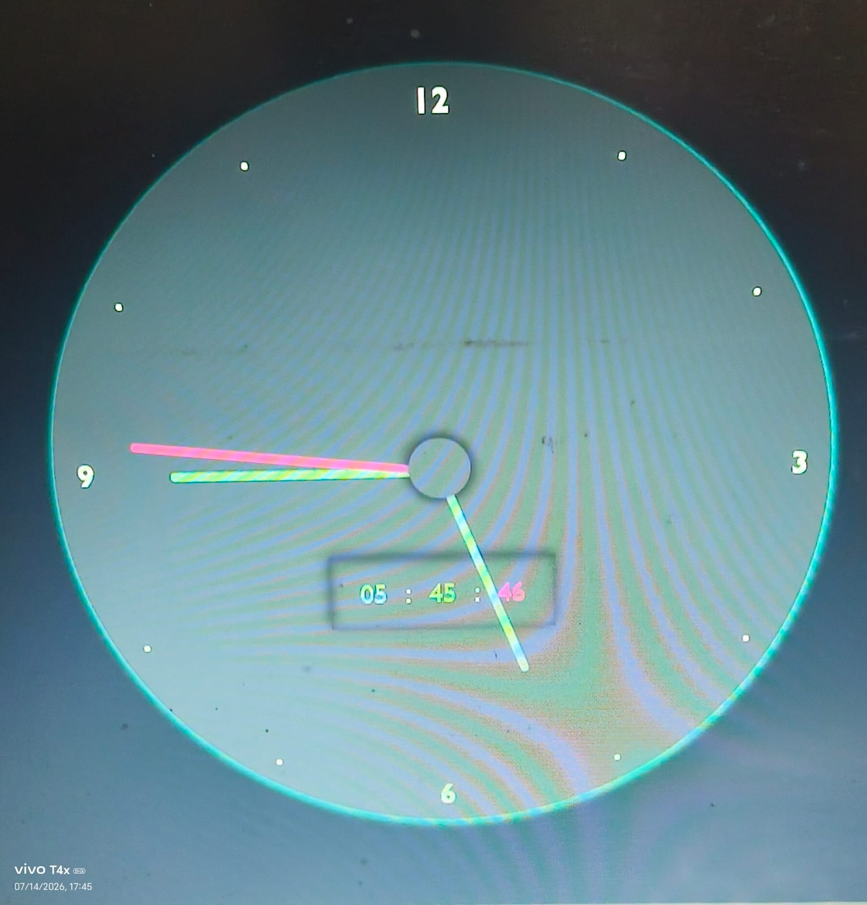

# 🕒 Analog & Digital Clock

A modern **Analog & Digital Clock** built using **HTML, CSS, and JavaScript**. The application displays the current time using both an animated analog clock and a real-time digital clock, offering a clean and responsive user interface.

---

## 🚀 Live Demo

🌐 https://rahulk0023.github.io/Analog-Digital-Clock/

---

## 📖 Project Overview

This project demonstrates how JavaScript can be used to create a real-time clock by updating the UI every second. The analog clock uses rotating clock hands, while the digital clock displays the current hour, minute, and second simultaneously.

The project is lightweight, responsive, and does not require any external libraries or frameworks.

---

## ✨ Features

- 🕒 Real-time Analog Clock
- ⏰ Real-time Digital Clock
- 🔄 Automatic Time Updates
- 🎨 Modern Dark Theme UI
- 📱 Responsive Design
- ⚡ Lightweight and Fast
- 💻 Built using Vanilla JavaScript

---

## 🛠️ Technologies Used

- HTML5
- CSS3
- JavaScript (ES6)

---

## 📂 Project Structure

```text
Analog-Digital-Clock/
│── index.html
│── style.css
│── script.js
└── README.md
```

---

## 🚀 How to Run

### Clone the Repository

```bash
git clone https://github.com/rahulk0023/Analog-Digital-Clock.git
```

### Open the Project

Simply open

```
index.html
```

in your browser

OR

Use **Live Server** in VS Code.

---

## 📸 Screenshot

Add a screenshot of your project inside a folder named:

```
images/
```

Example:

```
images/clock.png
```

Then display it like this:

```markdown

```

---

## ⚙️ How It Works

- JavaScript fetches the current system time.
- The hour, minute, and second hands rotate according to the current time.
- The digital clock updates every second.
- CSS transforms are used to animate the analog clock hands smoothly.

---

## 🔮 Future Improvements

- 🌙 Dark / Light Mode
- 🌍 Multiple Time Zones
- 📅 Current Date Display
- 📆 Day and Month Display
- ⏱ Stopwatch
- ⏲ Countdown Timer
- 🔔 Alarm Feature
- 🌐 12-Hour / 24-Hour Toggle

---

## 👨‍💻 Author

**Rahul Kumbhkar**

- GitHub: https://github.com/rahulk0023

---

## 🤝 Contributing

Contributions are welcome!

If you'd like to improve this project:

1. Fork the repository
2. Create a new branch
3. Commit your changes
4. Push your branch
5. Open a Pull Request

---

## ⭐ Support

If you found this project useful, consider giving it a **Star ⭐** on GitHub.

It motivates me to build more exciting projects.

---

## 📄 License

This project is open-source and available under the **MIT License**.

---

Made with ❤️ using HTML, CSS, and JavaScript.